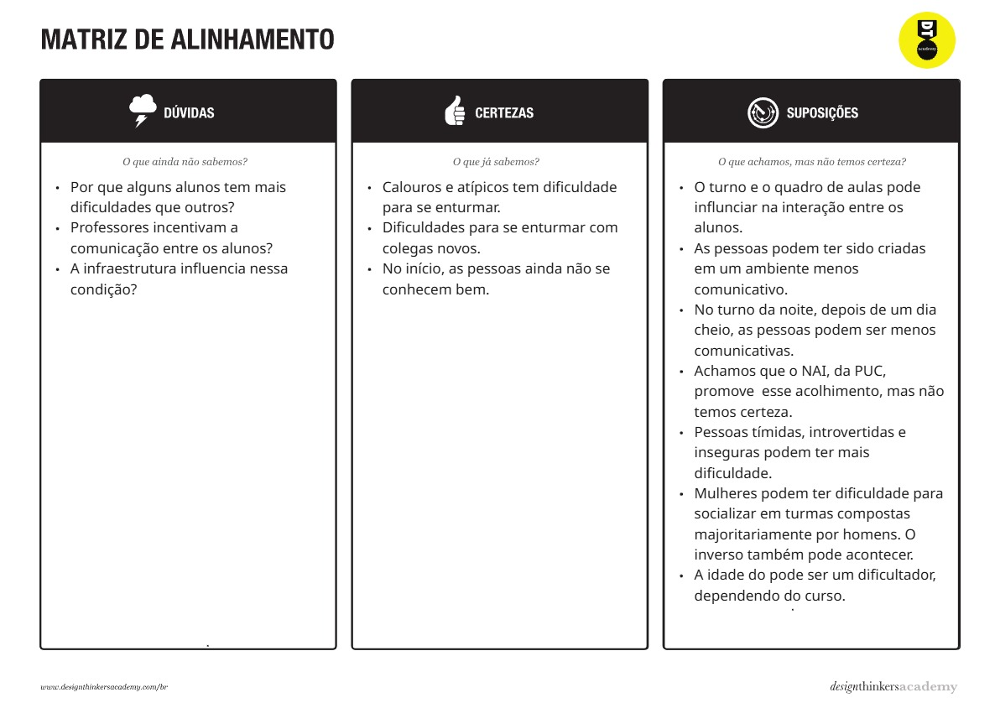

# Introdução

O trabalho interdisciplinar da matéria de Desenvolvimento de Aplicações Web, tem como objetivo visualizar e compreender as dificuldades sociais e comunicativas de grupos específicos durante o processo de adaptação - e continuidade - da vida acadêmica. Dessa forma buscamos entender quais as principais dificudades de grupos como: calouros, mulheres, terceira idade e pessoas atípicas enfrentam no ambiente universitário como um todo.

Com base na comprensão dessas dificuldades, busca-se desenvolver uma aplicação que facilite a comunicação e socialização no ambiente universitário da Pontíficia Universidade Católica. Devido aos benefícios de se possuir habilidades comunicativas desenvolvidas.

## Problema

A principal motivação para crição desta aplicação é a **dificuldade na comunicação com pessoas na faculdade**. Esta dificuldade afeta diversos aspectos da vida de quem a enfrenta, pois está diretamente relacionada com o desempenho acadêmico, saúde mental e física, oportunidades futuras no mercado de trabalho. Sendo assim, desenvolver a habilidade de comunição traz diversos benefícios para o indivíduo.

Nossa aplicação terá como foco o ambiente universitário da Pontíficia Universidade Católica. Tendo como público alvo, calouros dos mais diversos perfis socioeconômicos.

Segue abaixo nossa matriz CSD, por meio dela pode-se ter uma ampla visão do problema:

## Objetivos

O principal objetivo do trabalho é desenvolver uma aplicação que facilite a comunicação e socialização no ambiente universitário.

Os objetivos específicos do trabalho são:
- Elaborar uma interface acessível.
- Disponibilizar a aplicação para aparelhos móveis.
- Construir uma aplicação responsiva.

## Justificativa

Habilidades de comunicação e socialização desenvolvidas impactam diversos aspectos da vida do indíviduo. Pessoas solitárias são impactadas de diversas formas negativas, por exemplo: na vida acadêmica, profissional e na saúde. Observando isto, a elaboração de uma aplicação acessível, que facilite a comunicação e socialização, pode ser uma grande aliada para pessoas com dificuldades de comunicação. 

O extrato abaixo da matéria "OMS: uma em cada seis pessoas no mundo é afetada pela solidão" de Paula Laboissière (2025), vinculada no site Agência Brasil, sintetiza os impactos dessa solidão:

"O documento destaca, também, que a conexão social pode proteger a saúde ao longo da vida, reduzindo inflamações, diminuindo o risco de problemas graves de saúde, promovendo saúde mental e prevenindo a morte precoce, além de contribuir para tornar as comunidades mais saudáveis, seguras e prósperas.

Ao mesmo tempo, a solidão e o isolamento social aumentam o risco de acidente vascular cerebral (AVC), doenças cardíacas, diabetes, declínio cognitivo e morte prematura e também afetam a saúde mental – pessoas solitárias têm o dobro de probabilidade de desenvolver depressão.

“A solidão também pode levar à ansiedade e a pensamentos de automutilação ou suicídio”, ressaltou a OMS.

Os impactos se estendem ainda à aprendizagem e ao emprego. Adolescentes que se sentem solitários têm 22% mais chances de obter notas ou qualificações mais baixas, enquanto adultos solitários podem ter mais dificuldade para encontrar ou manter um emprego e ganhar menos ao longo do tempo.

“Em nível comunitário, a solidão prejudica a coesão social e custa bilhões em perda de produtividade e atenção à saúde. Comunidades com fortes laços sociais tendem a ser mais seguras, saudáveis ​​e resilientes, inclusive em resposta a desastres”, acrescenta a OMS."

## Público-alvo

Nosso público alvo são os alunos calouros da Pontíficia Universidade Católica dos mais diversos perfis socioeconômicos, tais como: mulheres, idosos e pessoas atípicas. Observando que cada grupo socioeconômico possui um nível diferente de dificuldade na comunicação. A aplicação tem como foco a plataforma mobile, pois grande maioria dos alunos possui um aparelho movél e uma certa familiaridade com esta tecnologia. Para ser mais acessível para o público alvo, a aplicação terá uma interface simples de fácil navegação. Desta forma, alunos com dificuldade na comunição terão uma forma de se comunicar de maneira mais fácil.
