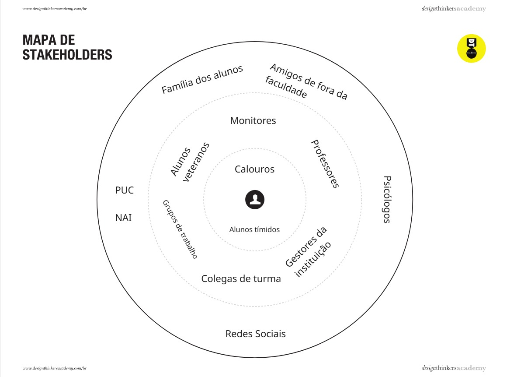
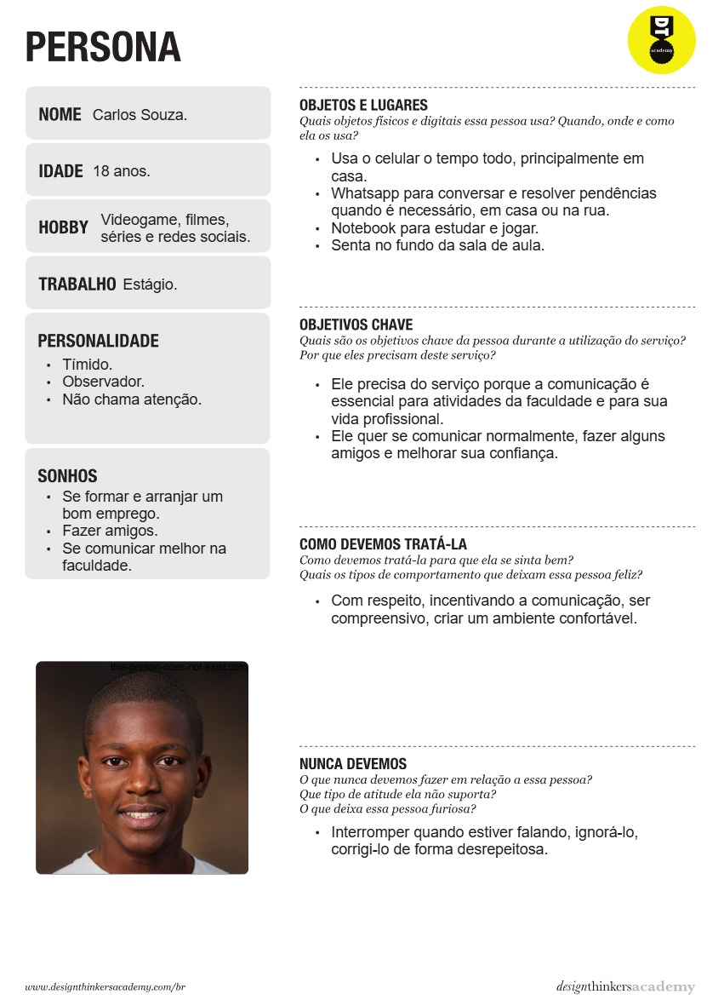
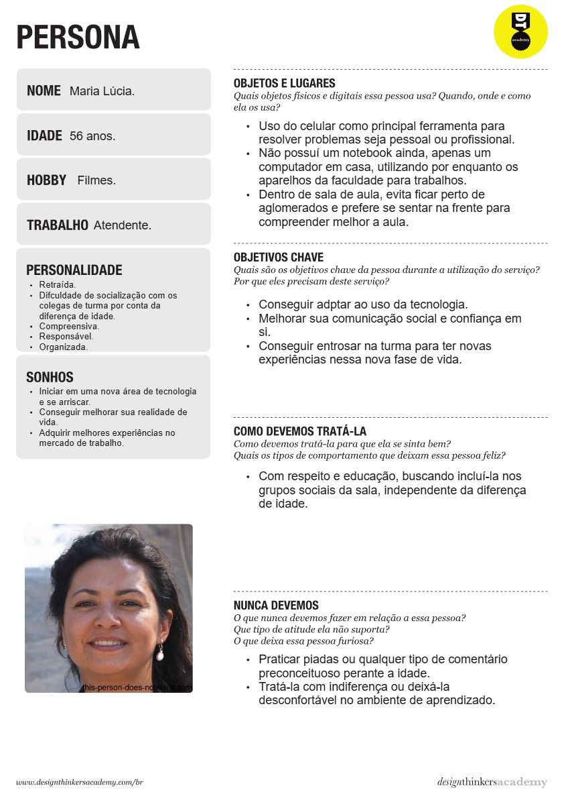
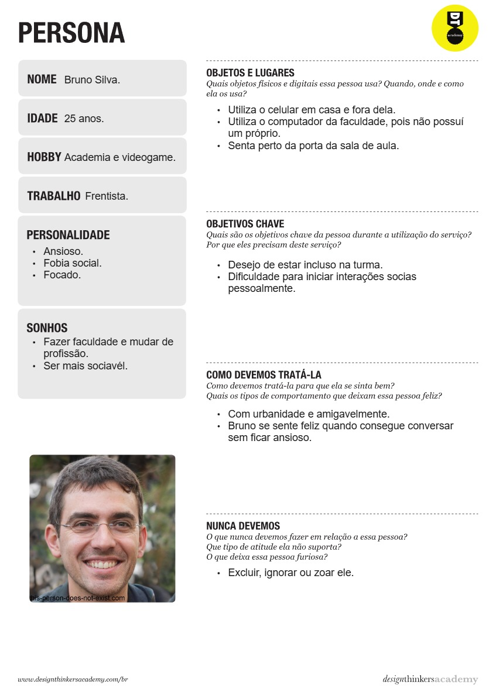

# Product discovery

## Etapa de entendimento

Nesta etapa, foram elaborados artefatos que nós deram um maior entendimento sobre o problema a ser abordado.

### Matriz CSD

A Matriz CSD (Certezas, Suposições e Dúvidas), também conhecida por Matriz de Alinhamento, é uma ferramenta utilizada no Design Thinking para organizar informações e facilitar o processo de tomada de decisão e solução de problemas. Ela ajuda equipes a esclarecer o que sabem com certeza, o que assumem ser verdade e o que precisam investigar mais a fundo.

A matriz é composta por três colunas:

- Certezas (C): Informações e fatos que são conhecidos e indiscutíveis. 
- Suposições (S): Hipóteses ou crenças que a equipe possui, mas que não foram confirmadas.
- Dúvidas (D): Perguntas e incertezas que precisam ser exploradas e respondidas.

### Mapa de Stakeholders

Stakeholders é o temo utilizado para referirmos a todos os interessados no projeto em que estamos envolvidos, seja de forma positiva ou negativa. O Mapa de Stakeholders nos permite obter um panorama macro dos interessados que fazem parte da rede de atuação do serviço. 

- Pessoas Fundamentais: Principais envolvidos no problema e representam os potenciais usuários de uma possível solução. Representadas no núcleo do mapa.
- Pessoas Importantes: Pessoas que ajudam ou dificultam o desenvolvimento e uso da solução e que devem ser consideradas. Representadas na segunda camada do mapa.
- Pessoas Influenciadoras: Pessoas ou entidades que devem ser consultadas para avaliar aspectos relevantes no ciclo de vida da solução. Representadas na terceira camada, mais externa do mapa.

### Highlights de Pesquisa

Consistem em informações chaves encontradas durante o processo de pesquisa.

- Muitos estudantes tem dificuldade de iniciar conversas na faculdade.
- Timidez, introversão, insegurança, fobia social, medo de atrapalhar são fatores comuns e que podem influenciar.
- Idade, gênero, renda e transtornos são outros fatores que podem dificultar essa socialização.
- A comunicação é essencial para trabalhos em grupo.
- Dificuldades para se enturmar no ambiente universitário.
- A socialização, autonomia e comunicação ajudam para melhor andamento de trabalhos em grupos, projetos de extensão e até mesmo a participação em sala de aula.
- Comunicação fora de sala é importante para tirar dúvidas sobre a instituição, melhorando a autonomia da pessoa.
- Pessoas solitárias tem maiores chances de desenvolver problemas de saúde.
- Interações sociais negativas por meio da internet podem ser prejudiciais ao indivíduo.

## Etapa de definição

### Personas

A partir das informações da pesquisa realizada e dos highlights, obtem-se uma compreensão mais rica do seu público-alvo. Uma definição clara das personas oferece a seu time uma compreensão mais completa dos seus clientes que, por sua vez, ajuda você a tomar melhores decisões de produto e marketing. 

- Entender o cliente: É essencial para as empresas obter uma compreensão profunda dos seus usuários e do que desejam, e as personas do usuário as ajudam a fazer isso. Ao combinar informações demográficas com informações sobre como os usuários interagem com o produto, as empresas podem entender melhor as necessidades e experiências dos seus usuários. 
- Identificar possíveis problemas: Entender quem são seus usuários também é um passo crítico para identificar as formas de melhorar seu produto para seu uso. Criar uma jornada do cliente única para cada persona mostrará - como cada persona aborda o produto e quais são seus pontos de dor.
- Melhorar o alinhamento da missão: Outro benefício da criação de personas é que ela ajudará todos em seu time a entender quais são os objetivos principais do time e a dar a todos uma ideia clara do usuário-alvo ideal. As personas do usuário informam tudo, desde marketing e vendas, até UX e UI. Portanto, garantir que todos os membros do seu time tenham uma compreensão básica do seu cliente ideal é fundamental.

Segue abaixo alguns exemplos de personas do projeto:

