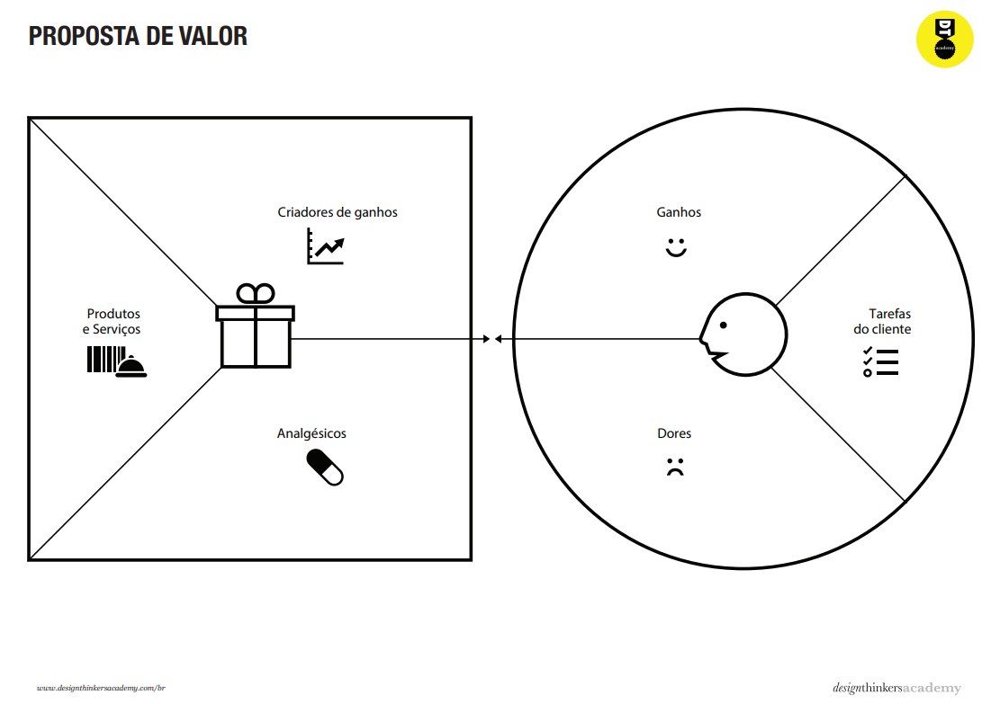
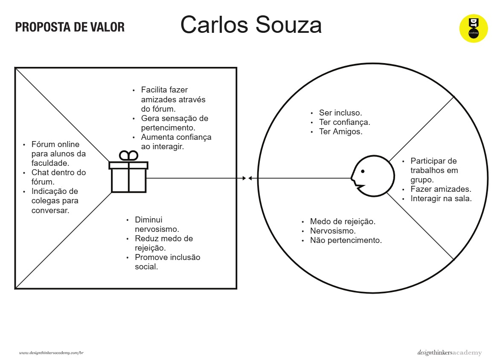
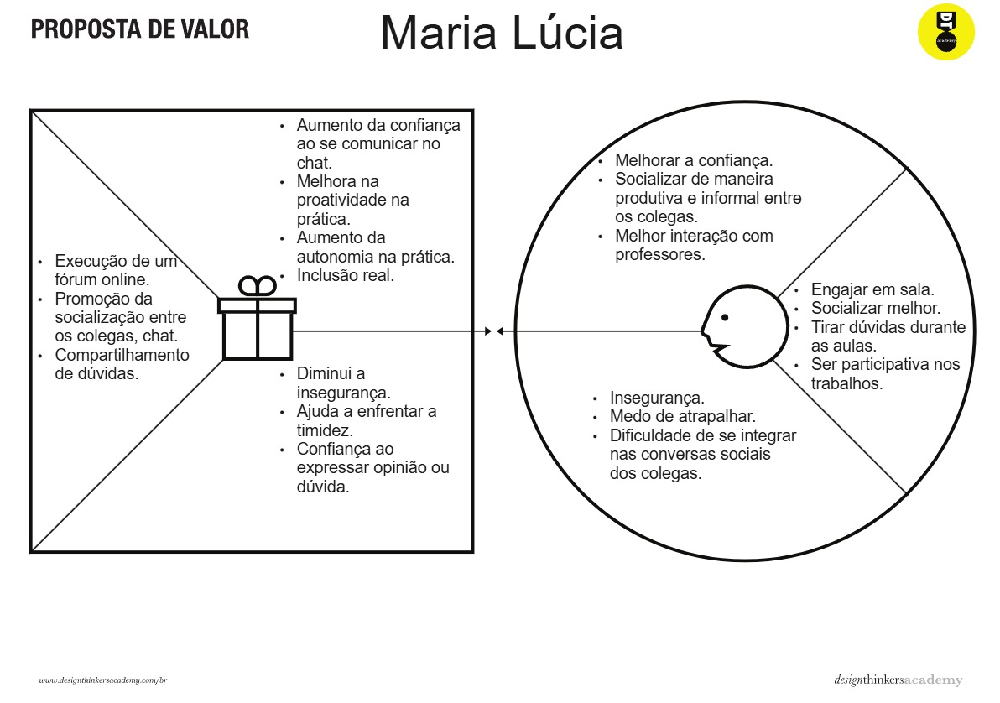
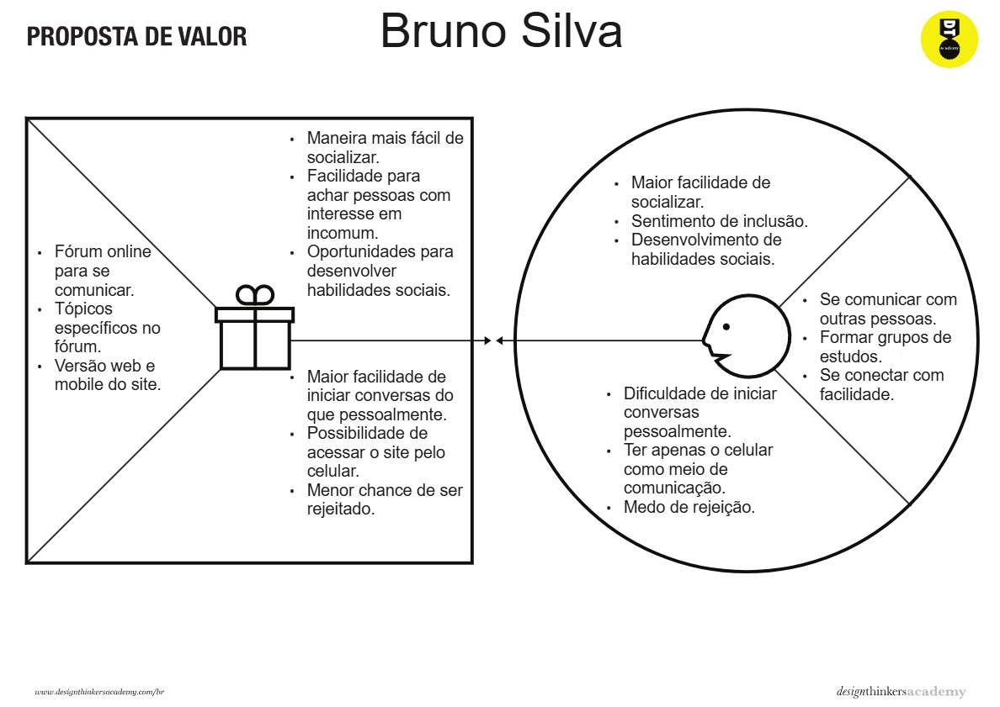

# Product design

## Histórias de usuários

Com base na análise das personas, foram identificadas as seguintes histórias de usuários:

|EU COMO... `PERSONA`| QUERO/PRECISO ... `FUNCIONALIDADE` |PARA ... `MOTIVO/VALOR`                 |
|--------------------|------------------------------------|----------------------------------------|
|Carlos Souza| Encontrar colegas com interesses parecidos no fórum           |Facilitar a criação de amizades|
|Carlos Souza| Participar de discussões em grupo no fórum                    |Me sentir mais incluido na faculdade|
|Carlos Souza| Fazer amizades na faculdade que não sejam só para estudo      |Porque acredito que com isso, a vida estudantil se torna mais leve e fácil|
|Bruno Silva | Fazer amizades na faculdade                                   |Me sentir incluido|
|Bruno Silva | Desenvolver minha fala e compreensão em discussões de trabalho|Ter melhor desempenho no futuro ambiente de trabalho|
|Bruno Silva | Desenvolver minhas habilidades sociais                        |Ter mais facilidade de arranjar emprego|
|Maria Lúcia | Sentir-me segura, integrar mais em sala de aula               |Socializar de forma produtiva e aumento de confiança|
|Maria Lúcia | Ser mais autônoma e proativa no ambiente social               |Obter mais autonomia, adaptabilidade e resolução de problemas no mercado|

## Proposta de valor

O mapa da proposta de valor é uma ferramenta que nos ajuda a definir qual tipo de produto ou serviço melhor atende às personas definidas anteriormente. Ele é composto de duas partes principais: o Perfil do Cliente e o Mapa de Valor.

Vamos entender cada parte desse instrumento e como preencher.

#### Perfil do cliente

- Tarefas do Cliente: Refere-se às tarefas que os clientes estão tentando realizar, os problemas que estão tentando resolver ou as necessidades que estão tentando satisfazer.
- Ganhos do Cliente: Resultados desejados e benefícios que os clientes esperam ou desejam ao realizar suas tarefas.
- Dores do Cliente: Todos os fatores que incomodam os clientes antes, durante ou após a realização de suas tarefas. Inclui riscos, problemas e obstáculos.

#### Mapa de Valor

- Produtos e Serviços: Lista de todos os produtos e serviços que a empresa oferece que ajudam o cliente a realizar suas tarefas.
- Criadores de Ganhos: Descrição de como os produtos e serviços criam ganhos para o cliente, ajudando-os a obter os benefícios desejados.
- Aliviadores de Dores: Descrição de como os produtos e serviços aliviam as dores do cliente, eliminando ou reduzindo fatores incômodos.

Segue abaixo um exemplo de proposta de valor:

Segue abaixo alguns exemplos de propostas de valores do projeto:

## Requisitos

As tabelas a seguir apresentam os requisitos funcionais e não funcionais que detalham o escopo do projeto.

### Requisitos funcionais

| ID     | Descrição do Requisito                                   | Prioridade |
| ------ | ---------------------------------------------------------- | ---------- |
| RF-001 | Permitir que o usuário crie postagens                            | ALTA      |
| RF-002 | Permitir que o usuário interaja com postagens de outros usuários | ALTA      |
| RF-003 | Permitir que o usuário se cadastre                               | MÉDIA     |
| RF-004 | Permitir que o usuário faça login                                | MÉDIA     |
| RF-005 | Permitir que o usuário configure seu perfil                      | MÉDIA     |
| RF-006 | Permitir que o usuário consulte seu histórico de postagens       | BAIXA     |
| RF-007 | Permitir que o usuário altere seu cadastro (nome e senha)        | BAIXA     |

### Requisitos não funcionais

| ID      | Descrição do Requisito                                                              | Prioridade |
| ------- | ------------------------------------------------------------------------------------- | ---------- |
| RNF-001 | O sistema deve ser responsivo para rodar em dispositivos móveis   | ALTA       |
| RNF-002 | Deve exigir pouco processamento para rodar em dispositivos móveis | ALTA       |
| RNF-003 | Deve salvar dados de cadastro do usuário                          | MÉDIA      |
| RNF-004 | Deve ter uma interface acessível                                  | MÉDIA      |

O requisitos foram ordenados de acordo com a sua necessidade para que os usuários possam interagir e socializar. Por exemplo, o RF-002 possui uma prioridade maior do que o RF-007, pois poder interagir com outros usuários é fundamental para o funcionamento do PucMeet, já a possibilidade de alterar seu cadastro é importante, mas não tanto quanto a interação entre usuários.

## Restrições

O projeto está restrito aos itens apresentados na tabela a seguir.

|ID| Restrição                                              |
|--|--------------------------------------------------------|
|001| O projeto deverá ser entregue até o final do semestre |
|002| Não é permitido o desenvolvimento de um banco de dados|
|003| Não é permitido o uso de outras ferramentas sem ser as específicadas para a construção do site|
