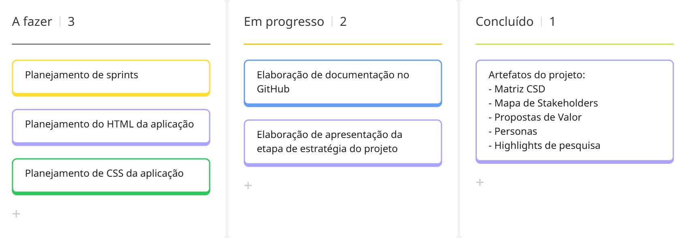

# Metodologia

Seção destinada a explicação de como o projeto está e será realizado.

## Controle de versão

A ferramenta [GitHub](https://github.com) foi utilizada para hospedagem do repositório.

Cada membro do grupo que participou da elaboração da documentação no GitHub possui sua branch, para facilitar a resolução de conflitos e afins. Segue abaixo a disposição das branchs:

- `main`
- `Alessandro`
- `Anna-Flávia`

> O membro `Luiz` acabou esquecendo de criar sua próprio branch, mas suas contribuições foram feitas diretamente no `main`. 

## Planejamento do projeto

###  Divisão de papéis

A equipe utiliza o Scrum como base para definição do processo de desenvolvimento.

- Scrum Master: Luiz 
- Product Owner: Alessandro
- Equipe de Desenvolvimento: Alessandro, Anna, Gabriel e Luiz. 
- Equipe de Design: Alessandro, Anna, Gabriel e Luiz.

### Processo

Para conceber o backlog do projeto, utilizou-se de Design Thinking. Durante esta etapa, foram realizadas diversas reuniões e foram construídos os seguintes artefatos:

- Matriz CSD
- Mapa de Stakeholders
- Propostas de Valor
- Personas
- Highlights de pesquisa

Segue abaixo o quadro Kanban do projeto:

## Ferramentas

| Ambiente                            | Plataforma                         | Link de acesso                       |
|-------------------------------------|------------------------------------|--------------------------------------|
| Processo de Design Thinking         | Miro                               | [https://miro.com](https://miro.com/pt/)
| Documentos do projeto               | GitHub                             | [https://github.com/ICEI-PUC-Minas-PCO-SI/2026-1-p1-tiaw-g5-pucmeet-1.git](https://github.com/ICEI-PUC-Minas-PCO-SI/2026-1-p1-tiaw-g5-pucmeet-1.git) | 
| Hospedagem do código                | GitHub                             | [https://github.com/ICEI-PUC-Minas-PCO-SI/2026-1-p1-tiaw-g5-pucmeet-1.git](https://github.com/ICEI-PUC-Minas-PCO-SI/2026-1-p1-tiaw-g5-pucmeet-1.git) |
| Projeto de interface                | Figma                              | [https://www.figma.com](https://www.figma.com/) |
| Comunicação                         | Whatsapp                           | [https://www.whatsapp.com](https://www.whatsapp.com/?lang=pt) |
| Codificação do projeto              | VS Code                            | [https://code.visualstudio.com](https://code.visualstudio.com) |

