# Projeto de interface

 Visão geral da interação do usuário pelas telas do sistema e protótipo interativo das telas com as funcionalidades que fazem parte do sistema (wireframes).

 ## User flow

O fluxo de navegação do PucMeet representa o caminho do usuário dentro da aplicação, desde o acesso inicial até a interação com posts e funcionalidades do sistema.

O fluxo contempla:
- Login e acesso ao sistema
- Navegação pelo feed
- Criação de posts
- Interação com publicações
- Acesso ao perfil e configurações

O fluxo completo pode ser visualizado no arquivo abaixo:

[📄 Visualizar User Flow do PucMeet (PDF)](files/userflowPucMeet.pdf)

## Wireframes

##### Tela de Login

A primeira tela que o usuário irá visualizar, podendo entrar com uma conta já existente ou apertar em criar conta.

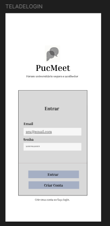

##### Tela de Criar Conta

Se o usuário optar por criar uma conta, a seguinte tela será exibida.

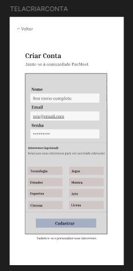

##### Tela Inicial

A tela do feed do PucMeet, onde o usuário poderá navegar pelos posts.

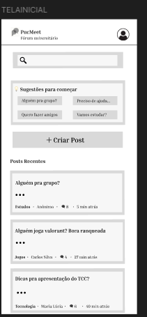

##### Tela de Criar Post

Se o usuário quiser criar um post, a seguinte tela será exibida, com instruções.

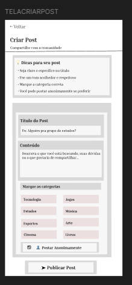

##### Tela de Perfil

A tela que será exibida se o usuário optar por ver seu perfil.

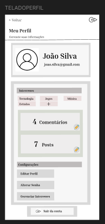

##### Tela de Ver Seus Posts

Tela que exibe todos os posts criados pelo usuário.

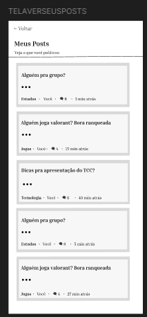

##### Tela de Ver Seu Post

Tela que exibe um post especifico do usuário, exibida ao clicar em um post.

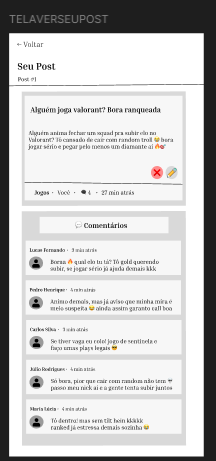

##### Tela de Ver Seus Comentários

Tela que exibe todos os comentários feitos pelo usuário em posts alheios.

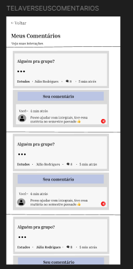

##### Tela de Ver Um Post

Ao clicar em um post no feed, a tela com o post será exibida.

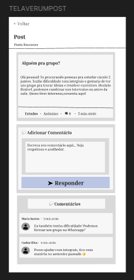

##### Tela de Editar Perfil

Se o usuário decidir dar uma cara nova ao seu perfil, a tela abaixo será mostrada.

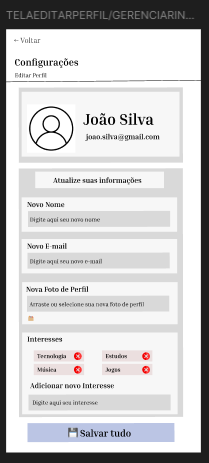

##### Tela de Alterar Senha

Tela exibida quando o usuário decide mudar sua senha.

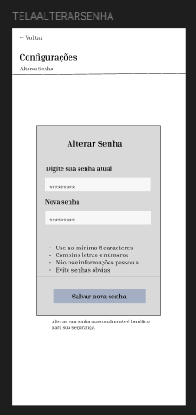
 

### Protótipo Interativo

O protótipo interativo foi desenvolvido no Figma e permite simular a navegação entre as telas do PucMeet.

Através dele, é possível testar:
- Navegação entre telas
- Criação de posts
- Interação com comentários
- Acesso ao perfil e configurações

[🔗 Acessar Protótipo Interativo](https://www.figma.com/proto/HdOaFuO3P1CTXk7BGMphWl/F%C3%B3rum-PucMeet?node-id=2-218&t=JBgt1GKutSFKXqwA-1&starting-point-node-id=2%3A218)
