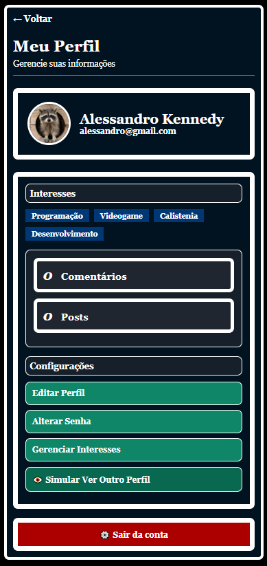
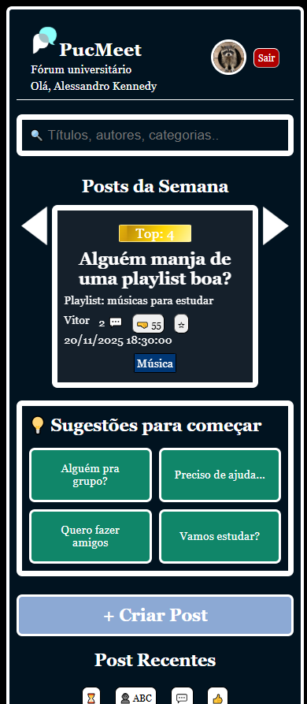

# Template padrão da aplicação

Layout padrão da aplicação que será utilizado em todas as páginas, definindo a identidade visual, aspectos de responsividade e iconografia. Inclui também o manual da marca, com orientações sobre paleta de cores, tipografia, elementos gráficos e uso correto do logotipo, além da explicação do processo de criação e do significado do logo, evidenciando sua relação com a proposta visual e os valores da aplicação. Deve ser apresentada apenas uma tela de exemplo para demonstrar a aplicação do template e das diretrizes visuais.

## Paleta de cores do site

Escolheu-se uma paleta de cores que fosse simples e que remetesse ao PUC Mobile. Visto que a aplicação tem como público alvo os alunos da PUC Minas. Segue abaixo as principais cores:

- #011320 `Azul escuro` 
- rgba(40, 44, 53, 0.527) `Cinza escuro`
- #108669 `Verde claro`
- #003775 `Azul claro`

Para logo, optou-se por algo simples e de fácil reconhecimento. Dois balões de fala, um branco e um ciano, que remetem a função princiapal do site, a comunicação.